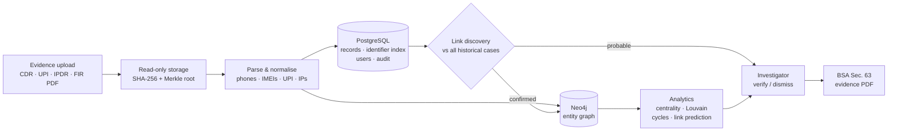

# Sandhan: AI-Powered Criminal Network Analysis

> **Smart India Hackathon 2026 · PS SIH26189 · Ministry of Home Affairs · Blockchain & Cybersecurity**
> Working title in our blueprint: *Nexus-Trace*

Every day, police stations across India register cyber-fraud complaints: fake KYC calls, investment
scams, "customs parcel" threats. Often the **same gang** is behind complaints in different states, but the
evidence sits in separate call records, bank statements and FIRs, so nobody connects them.

**Sandhan connects them.** Upload a new case's evidence and Sandhan:

1. **Extracts** every phone number, handset (IMEI), UPI ID, bank account and IP address
2. **Matches** them against the historical case database (220 synthetic past cases in this demo) and
   explains every link it finds
3. **Builds one network** of the new case plus every linked past case
4. **Analyses** it: kingpins, gangs, money-laundering loops, and hidden links
5. **Keeps a human in control**: AI leads must be verified by an investigator before they count
6. **Exports** a court-ready certificate under **Section 63, Bharatiya Sakshya Adhiniyam 2023**

<p align="center">         </p>
> ⚠️ **All data in this repository is synthetic.** No real persons, numbers or accounts are used.

---

## 🎥 Demo

**Prototype demo video:** `https://youtu.be/<your-video-id>`   *(add the link and QR code here)*

---

## ✨ Key features

| Feature | What it does |
|---|---|
| **Historical link discovery** | Compares every new case against *all* past cases in one indexed query. Each link is **confirmed** (exact suspect-side match) or **probable** (weaker signals, needs human verification), with the evidence listed. |
| **Identity normalisation** | `98123 45601`, `09812345601` and `+91-9812345601` are all the same phone; UPI IDs are case-insensitive; IMEIs are validated with the Luhn checksum. Messy real-world formats still match. |
| **Case network graph** | Neo4j graph of phones, devices, UPI accounts, bank accounts and IPs, linked by calls, payments and device use, across the live case and its linked historical cases. |
| **Kingpin detection** | Betweenness, Eigenvector centrality and PageRank rank the most important actors. |
| **Gang detection** | Louvain community detection groups the network into clusters, with no training data. |
| **Laundering loops** | Tarjan SCC + cycle search over directed money flow finds money that returns to its origin, even across different cases. |
| **Link prediction** | An explainable graph score (Adamic-Adar) suggests hidden links, e.g. two suspects who never call each other but share a handler and an IP. |
| **Human-in-the-loop** | Every AI lead must be **verified or dismissed**. Export is blocked (server-side) until all leads are decided. |
| **DPDP privacy** | Third-party (victim) numbers are masked (`+91-XXXXXX-1234`). Unmasking is an explicit, logged escalation. |
| **Court-ready evidence** | Original files are locked read-only and SHA-256 hashed into a per-case **Merkle root** (+ QR code). The PDF certificate includes the BSA Sec. 63(4)(c) two-part declaration. |
| **Audit & RBAC** | Investigators see only their assigned cases; admins manage accounts but can never read case content. Every action is logged. |
| **M.O. matching** *(optional)* | SBERT compares FIR narratives to spot the same scam script across cases. |

---

## 🏗️ Architecture



### Tech stack

| Layer | Technology |
|---|---|
| **Frontend** |     |
| **Backend API** |    |
| **Databases** |    |
| **Graph analytics** |  |
| **Parsing & validation** |    |
| **NLP** *(optional)* |    |
| **Evidence & security** |   |
| **Infrastructure** |  |

---

## 🔗 How historical linking works

Every identifier from every case goes into one Postgres table, `identifier_index`, tagged with its case
and its **role** (suspect side or counterparty). A new case is compared against all historical cases in
one indexed query, so it scales from 200 to 20,000 cases.

Each shared identifier adds evidence:

| Signal | Weight |
|---|---|
| Same handset (IMEI) / bank account | 0.90 / 0.85 |
| Same phone / UPI ID | 0.75 |
| …on the suspect side in both cases / one case / neither | × 1.0 / 0.85 / 0.35 |
| …shared by many cases (a common merchant) | down-weighted; identifiers in more than 5 cases can never confirm a link |
| Look-alike UPI handle (`name@bankA` vs `name@bankB`) | 0.25 |
| Similar FIR narrative (SBERT) | ≤ 0.28 |

Scores combine as `1 − Π(1 − w)`.
- **Confirmed:** a hard match on the suspect side. Added to the graph automatically.
- **Probable:** two or more independent weak signals. Shown as a lead for the investigator to verify.
  **One coincidence alone is never a lead.**

On the 220-case dummy database this finds **29 confirmed links forming 23 case networks**. Re-uploading a
historical case with every identifier reformatted still finds the same links
(`python backend/scripts/link_report.py --replay CASE0105 --perturb`).

---

## 🚀 Getting started

### Prerequisites
- **Python 3.11** (3.10–3.12; not 3.13)
- **Node.js 18+**
- **PostgreSQL 14+** (e.g. with pgAdmin)
- **Neo4j 5.x or 2026.x** (e.g. Neo4j Desktop)
- *or* Docker: `docker compose up -d` starts both databases

### 1. Databases

**PostgreSQL**: in pgAdmin → Query Tool, run each line separately:
```sql
CREATE USER sandhan_app WITH PASSWORD 'sandhan';
CREATE DATABASE sandhan_v2 OWNER sandhan_app;
```
Then open a Query Tool **on the `sandhan_v2` database** and run:
```sql
ALTER SCHEMA public OWNER TO sandhan_app;
```

**Neo4j**: in Neo4j Desktop, create and start a local instance and note its password.

### 2. Backend
Run from the repository root:
```powershell
python -m venv venv
.\venv\Scripts\Activate.ps1            # macOS/Linux: source venv/bin/activate
pip install -r backend\requirements.txt
copy backend\.env.example backend\.env # macOS/Linux: cp backend/.env.example backend/.env
```
Edit `backend\.env`:
```
POSTGRES_DB=sandhan_v2
POSTGRES_USER=sandhan_app
POSTGRES_PASSWORD=sandhan
SANDHAN_GRAPH_BACKEND=neo4j
NEO4J_URI=bolt://127.0.0.1:7687
NEO4J_USER=neo4j
NEO4J_PASSWORD=<your Neo4j password>
```
Then:
```powershell
python backend\scripts\check_setup.py   # every line OK (WARN = optional extras)
python backend\scripts\bootstrap.py     # tables, demo users, loads the 220 historical cases
uvicorn app.main:app --app-dir backend --reload --port 8000
```
Health check: http://localhost:8000/api/v1/health → `"status": "ok"`, `"cases": 220`

**Optional NLP** (FIR name extraction + M.O. matching, about 1 GB):
```powershell
pip install torch==2.4.1 --index-url https://download.pytorch.org/whl/cpu
pip install -r backend\requirements-nlp.txt
python -m spacy download en_core_web_sm
```

### 3. Frontend
```powershell
copy frontend\.env.local.example frontend\.env.local
npm --prefix frontend install
npm --prefix frontend run dev
```
Open http://localhost:3000

| Role | Username | Password |
|---|---|---|
| Investigator | `investigator1` | `invest123` |
| Admin | `admin` | `admin123` |

### 4. Verify
```powershell
python backend\scripts\smoke_test.py    # runs the whole demo flow, expect 20/20 checks passed
python backend\scripts\reset_demo.py    # clears the test run
```

---

## 🕵️ Demo walkthrough

**Data used**
| | Where | What |
|---|---|---|
| **Historical database** (past cases) | `data/historical/` | 220 closed cases, 8,756 call/payment records. Loaded once by `bootstrap.py`. |
| **Live cases** (to investigate) | `data/demo/CASE-2026-000X/` | 3 new complaints, each with `cdr.csv`, `upi.csv`, `ipdr.csv` and an FIR (PDF/TXT) |

**Steps** (log in as `investigator1`)
1. **Baseline SQL lookup**: search `rahulk.scam` to see flat, disconnected rows (how it works today).
2. Select **CASE-2026-0001** → **Ingest files** → upload its 4 files.
3. **Historical links** tab: **CASE0113 · confirmed**, because the collection account paid ₹45,000 to that
   2024 case's suspect UPI.
4. Ingest **CASE-2026-0002** (links to historical **CASE0047** via a shared handset) and
   **CASE-2026-0003** (**probable** lead to CASE0082: click **Verify link**).
5. Back on CASE-2026-0001, the network spans 6 cases:
   - **Betweenness**: `scamdesk01@okhdfc` is the broker
   - **Louvain**: gangs
   - **Tarjan SCC + cycles**: the laundering loop `scamdesk01 → mule.acc02 → cashout.hub7 → scamdesk01`
     across two cases
6. **Run link prediction**: `+919812345601 ↔ +919812345604` (shared handler + IP) → **Verify**, then
   dismiss the rest.
7. **Export certificate**: the BSA Sec. 63 PDF.

---

## 📡 API reference

Interactive docs (Swagger UI) are generated automatically. With the backend running, open
**http://localhost:8000/docs**, click **Authorize**, sign in as `investigator1` / `invest123`, and try
any endpoint in the browser. The raw OpenAPI schema is at `/openapi.json`.

**Authentication:** `POST /api/v1/auth/login` (form fields `username`, `password`) returns a JWT. Send it
as `Authorization: Bearer <token>`. Investigator endpoints also check that the case is assigned to the
caller; admin tokens can never read case content.

### Auth & health
| Method | Endpoint | Description |
|---|---|---|
| `POST` | `/api/v1/auth/login` | Log in, returns JWT + role + assigned cases |
| `GET` | `/api/v1/auth/me` | Current user and live list of assigned cases |
| `GET` | `/api/v1/health` | Postgres + Neo4j status and historical DB size (no login) |

### Ingestion
| Method | Endpoint | Description |
|---|---|---|
| `POST` | `/api/v1/upload/ingest` | Multipart upload (`case_id`, `files[]`, optional `declared_type`); returns `job_id` |
| `GET` | `/api/v1/upload/jobs/{job_id}` | Job status and result (fallback if the WebSocket is missed) |
| `WS` | `/ws/v1/graphstream?case_id=` | Live progress: `storing → parsing → linking → ingestion_complete` |

### Historical link discovery
| Method | Endpoint | Description |
|---|---|---|
| `GET` | `/api/v1/links/historical?case_id=&refresh=` | Ranked linked cases with evidence + the case's network (DSU cluster) |
| `POST` | `/api/v1/links/decide` | HITL on a probable link: `{case_id, other_case_id, decision: "verify" \| "dismiss"}` |

### Graph
| Method | Endpoint | Description |
|---|---|---|
| `GET` | `/api/v1/graph/integrated?case_id=&hops=` | Case network: the case + linked cases, entities and edges (DPDP-masked) |
| `GET` | `/api/v1/graph/subgraph?case_id=&center_node=&hops=` | N-hop neighbourhood of one entity |
| `GET` | `/api/v1/graph/search?case_id=&prefix=` | Trie prefix search for phones / IMEIs / UPI IDs |
| `POST` | `/api/v1/graph/escalate` | Unmask a third-party identifier (logged): `{case_id, entity_id, reason}` |

### Analytics
| Method | Endpoint | Description |
|---|---|---|
| `POST` | `/api/v1/analytics/ringleaders` | Betweenness, eigenvector, PageRank, Louvain, cycles in one call: `{case_id}` |
| `GET` | `/api/v1/analytics/smurfing-cycles?case_id=&max_depth=5&threshold=50000` | Laundering cycles (Tarjan SCC + cycle search) |
| `POST` | `/api/v1/analytics/predict-links` | Link prediction; results stored as *pending*: `{case_id, top_k}` |
| `GET` | `/api/v1/analytics/predicted-links?case_id=` | Pending (undecided) predictions |

### Evidence & HITL
| Method | Endpoint | Description |
|---|---|---|
| `POST` | `/api/v1/evidence/verify-node` | Verify a predicted link: `{case_id, source_id, target_id, score}` |
| `POST` | `/api/v1/evidence/dismiss-prediction` | Dismiss a predicted link: `{case_id, source_id, target_id, reason}` |
| `GET` | `/api/v1/report/evidence-pdf?case_id=` | BSA Sec. 63 certificate PDF (`409` while predictions are pending) |

### NLP, baseline & audit
| Method | Endpoint | Description |
|---|---|---|
| `POST` | `/api/v1/nlp/mo-match` | SBERT M.O. match of FIR text against historical FIRs: `{case_id, fir_text}` (`503` if NLP not installed) |
| `GET` | `/api/v1/baseline/search?q=` | Act-1 siloed SQL keyword lookup (flat rows) |
| `GET` | `/api/v1/investigator/audit-log?case_id=` | Case-level audit trail (own cases only) |

### Admin (no case content)
| Method | Endpoint | Description |
|---|---|---|
| `GET` / `POST` | `/api/v1/admin/users` | List / create users |
| `POST` | `/api/v1/admin/users/{user_id}/assign-case` | Assign a case (live or historical ID) to an investigator |
| `POST` | `/api/v1/admin/users/{user_id}/role` | Change a user's role |
| `GET` | `/api/v1/admin/audit-log` | System-level audit log (logins, account changes, exports) |

### Example
```bash
# log in
curl -X POST http://localhost:8000/api/v1/auth/login -d "username=investigator1&password=invest123"

# upload a case (use the access_token from above)
curl -X POST http://localhost:8000/api/v1/upload/ingest \
  -H "Authorization: Bearer <token>" \
  -F case_id=CASE-2026-0001 \
  -F files=@data/demo/CASE-2026-0001/cdr.csv \
  -F files=@data/demo/CASE-2026-0001/upi.csv

# see which historical cases it links to
curl "http://localhost:8000/api/v1/links/historical?case_id=CASE-2026-0001" -H "Authorization: Bearer <token>"
```

Frontend wrappers for every endpoint are in `frontend/src/services/api.js`; the WebSocket client is in
`frontend/src/services/socket.js`.

---

## 🧪 Testing & tools

| Command | Purpose |
|---|---|
| `python backend/scripts/check_setup.py` | Checks dependencies, models and database connections |
| `python backend/scripts/smoke_test.py` | End-to-end demo flow against the running server (real Postgres + Neo4j) |
| `python backend/tests/test_end_to_end.py` | 47 in-process checks (needs a throwaway Postgres database) |
| `python backend/scripts/link_report.py CASE0080` | Links of any case, from the terminal |
| `python backend/scripts/link_report.py --csv file.csv` | Dry run: what would this CSV link to? |
| `python backend/scripts/link_report.py --summary` | Link distribution across the historical database |
| `python backend/scripts/reset_demo.py` | Clears live cases (keeps the historical database) |

**Using your own historical data:** place CSVs with the same columns in `data/historical/`, then run
`python backend/scripts/make_historical_firs.py` and `python backend/scripts/load_historical.py`.

---

## 📁 Project structure

```
sandhan/
├── backend/
│   ├── app/
│   │   ├── api/v1/          REST endpoints (auth, upload, graph, analytics, links, evidence, admin)
│   │   ├── db/              PostgreSQL models · Neo4j graph store (all Cypher in neo4j_client.py)
│   │   ├── services/        normalizer · link_engine · historical_loader · graph_analytics
│   │   │                    hitl_gate · privacy_guard · evidence_engine · nlp_processor
│   │   └── ws/              live ingestion progress (WebSocket)
│   ├── scripts/             bootstrap · check_setup · smoke_test · link_report · reset_demo
│   └── tests/
├── frontend/src/            Next.js pages (cases, baseline, admin) + components (graph canvas, panels)
├── data/
│   ├── historical/          dummy historical database (220 cases)
│   └── demo/                3 live demo cases
└── docker-compose.yml       Postgres + Neo4j (optional)
```

---

## ⚖️ Legal grounding

- **Bharatiya Sakshya Adhiniyam 2023, Sec. 63**: electronic evidence needs a certificate stating the
  record's **hash value**. Sandhan hashes every file at ingestion and prints the Merkle root, QR code
  and the two-part (custodian + expert) certificate.
- **Digital Personal Data Protection Act 2023, Sec. 17(1)(c)**: processing for investigation of
  offences is exempt from consent. Sandhan still applies care: role-based access, third-party masking
  and an immutable audit log.
- **Positioning:** Sandhan is designed as an intelligence layer that could sit **alongside** existing
  systems (CCTNS, NCRP, I4C Samanvaya), not replace them. Claims about those systems are based only on
  public information.

---

## 🧭 Current limitations & roadmap

| Now (prototype) | Next |
|---|---|
| Link prediction uses an explainable heuristic (Adamic-Adar) | Train a HeteroGNN on labelled synthetic ground truth |
| Link weights and SBERT threshold are hand-set | Calibrate against labelled case pairs |
| English FIRs; text PDFs only | IndicTrans + IndicNER for regional languages; OCR for scanned FIRs |
| Local read-only folder as evidence store | MinIO object lock (WORM) + RFC 3161 timestamps |
| Background tasks for ingestion | Celery/Redis queue for scale |
| Masking applied in UI and PDF | Tokenised identifiers end-to-end |

---

## 👥 Team

| Member | Role |
|---|---|
| *Ujjawal* | Backend / API |
| *Ujjawal* | Graph & databases |
| *Piyush* | Analytics |
| *Rohaan & Dhanveen* | Frontend & UI |
| *Priyanshi & Shweta* | Data & demo |
| *Priyanshi* | Pitch & legal |

---

<sub>Built for Smart India Hackathon 2026. All data is synthetic and for demonstration only.</sub>
